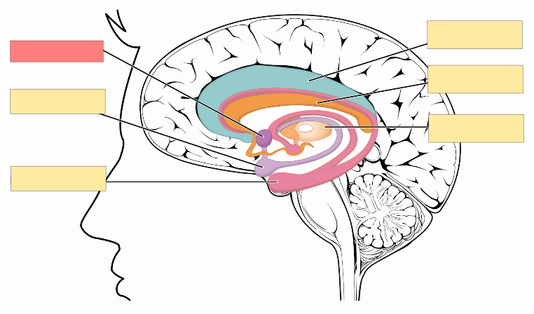

<h2 align="center">Image Occlusion Enhanced for Anki</h2>

 

> Flashcards from images – the easy way

*Image Occlusion Enhanced* is an add-on for the spaced repetition flashcard app [Anki](https://apps.ankiweb.net/) that allows you to create image-based cloze-deletions.

### Table of Contents <!-- omit in toc -->

<!-- MarkdownTOC levels="1,2,3" -->

- [Screenshots](#screenshots)
- [Installation](#installation)
- [Documentation](#documentation)
- [Building](#building)
- [Contributing](#contributing)
- [License and Credits](#license-and-credits)

<!-- /MarkdownTOC -->

### Screenshots

*Creating Cards With the Add-on:*

*Reviewing Generated Cards:*

### Installation

#### AnkiWeb <!-- omit in toc -->

The easiest way to install Image Occlusion Enhanced is through [AnkiWeb](https://ankiweb.net/shared/info/1374772155).

#### Manual installation <!-- omit in toc -->

1. Make sure you have the [latest version](https://apps.ankiweb.net/#download) of Anki 2.1 installed. Earlier releases (e.g. found in various Linux distros) do not support `.ankiaddon` packages.
2. Download the latest `.ankiaddon` package from the [releases tab](https://github.com/glutanimate/image-occlusion-enhanced/releases) (you might need to click on *Assets* below the description to reveal the download links)
3. From Anki's main window, head to *Tools* → *Add-ons*
4. Drag-and-drop the `.ankiaddon` package onto the add-ons list
5. Restart Anki

### Documentation

The installation and use of this add-on is detailed in the [Wiki](https://github.com/Glutanimate/image-occlusion-enhanced/wiki) and a [series of video tutorials on YouTube](https://www.youtube.com/playlist?list=PL3MozITKTz5YFHDGB19ypxcYfJ1ITk_6o). More information may also be found in the [AnkiWeb description](docs/description.md).

### Building

With [Anki add-on builder](https://github.com/glutanimate/anki-addon-builder/) installed:

    git clone https://github.com/glutanimate/image-occlusion-enhanced.git
    cd image-occlusion-enhanced
    aab build

For more information on the build process please refer to [`aab`'s documentation](https://github.com/glutanimate/anki-addon-builder/#usage).

### Contributing

Contributions are welcome! Please review the [contribution guidelines](./CONTRIBUTING.md) on how to:

- Report issues
- File pull requests
- Support the project as a non-developer

### License and Credits

*Image Occlusion Enhanced* is

*Copyright © 2012-2015 [Tiago Barroso](https://github.com/tmbb)*

*Copyright © 2013 [Steve AW](https://github.com/steveaw)*

*Copyright © 2016-2022 [Aristotelis P.](https://glutanimate.com/) (Glutanimate)*

With code contributions from: Damien Elmes, Kyle Mills, James Kraus, Matt Restko

-----

*Image Occlusion Enhanced* is based on [Image Occlusion 2.0](https://github.com/tmbb/image-occlusion-2) by Tiago Barroso and [Simple Picture Occlusion](https://github.com/steveaw/anki_addons) by Steve AW. All credit for the original add-ons goes to their respective authors. *Image Occlusion Enhanced* would not exist without their work.

I would also like to extend my heartfelt thanks to everyone who has helped with testing, provided suggestions, or contributed in any other way.

*Image Occlusion Enhanced* ships with the following third-party open-source software:

- [SVG Edit](https://github.com/SVG-Edit/svgedit) 2.6. Copyright (c) 2009-2012 by SVG-edit authors. Licensed under the MIT license.

- [Python Imaging Library](http://www.pythonware.com/products/pil/) (PIL) 1.1.7. Copyright (c) 1997-2011 by Secret Labs AB, Copyright (c) 1995-2011 by Fredrik Lundh. Licensed under the [PIL license](http://www.pythonware.com/products/pil/license.htm)

- [imagesize.py](https://github.com/shibukawa/imagesize_py) v0.7.1. Copyright (c) 2016 Yoshiki Shibukawa. Licensed under the MIT license.

Image Occlusion Enhanced is free and open-source software. The add-on code that runs within Anki is released under the GNU AGPLv3 license, extended by a number of additional terms. For more information please see the [LICENSE](https://github.com/glutanimate/image-occlusion-enhanced/blob/master/LICENSE) file that accompanied this program.

This program is distributed in the hope that it will be useful, but WITHOUT ANY WARRANTY.

----
<b>

The continued development of this add-on is made possible  thanks to my <a href="https://www.patreon.com/glutanimate">Patreon</a> and <a href="https://ko-fi.com/X8X0L4YV">Ko-Fi</a> supporters.
 You guys rock ❤️ !

</b>