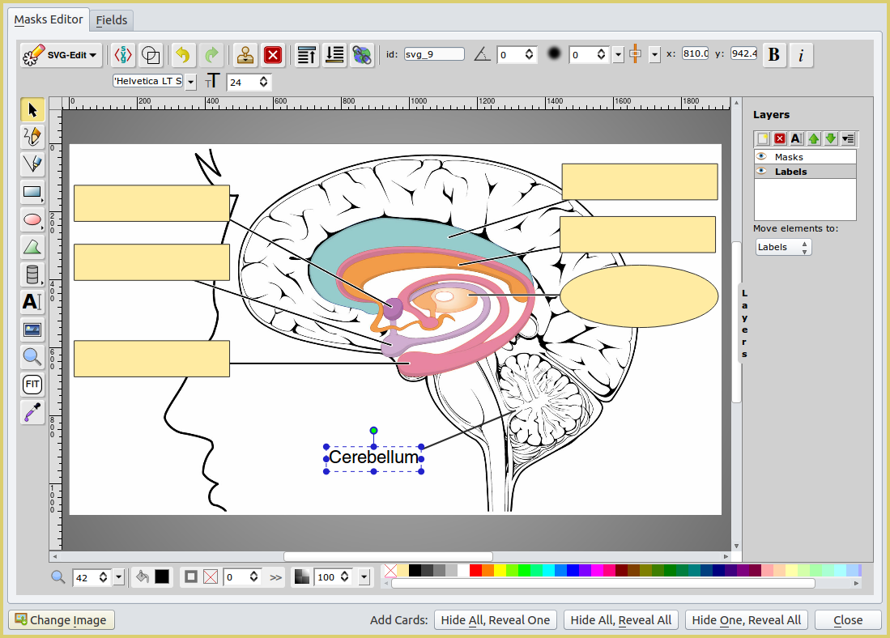
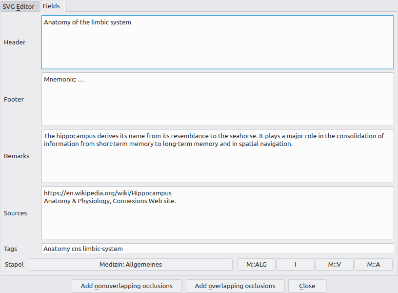
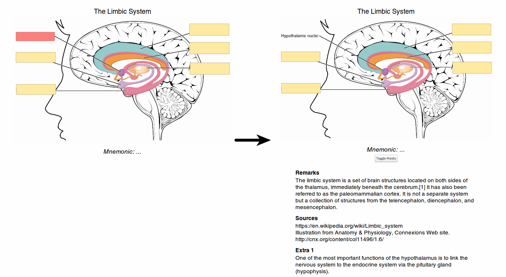

## Image Occlusion Enhanced

*Image Occlusion Enhanced* is an add-on for the spaced repetition flashcard app [Anki](http://ankisrs.net/). It allows you to create flashcards that hide parts of an image to test your knowledge of that hidden information.

### Table of Contents

<!-- MarkdownTOC -->

- [Screenshots](#screenshots)
- [Changes Compared to Image Occlusion 2.0](#changes-compared-to-image-occlusion-20)
- [Documentation](#documentation)
- [Known Issues](#known-issues)
- [Credits and License](#credits-and-license)

<!-- /MarkdownTOC -->

### Screenshots

*Creating Cards With the Add-on:*

*Reviewing Generated Cards:*

### Changes Compared to Image Occlusion 2.0

- **Modify Existing Notes**: Update and modify your IO notes to your heart's content
- **Change Images on the Fly**: Switch to a different image right from the Editor
- **Create Custom Labels**: Your image is lacking a specific label? Now you can create it yourself!
- **Completely Overhauled UI**: Tabs, multi-line entry fields, numerous new hotkey assignments
- **Completely Reworked Note Type**: 4 additional fields, new intuitive field order
- **Updated Card Template**: New card layout, a button to reveal all masks, optimizations for AnkiMobile
- **Full Customization**: Add and rename as many fields as you like
- **Updated Options Interface**: More options, fewer bugs
- **Fully Rewritten Note Generator**: Faster, more extensible, and less bug-prone
- **Performance Improvements**: Smaller memory footprint in general use
- **Stability Improvements**: Bug fixes everywhere

For more information on recent improvements and additions make sure to check out the changelogs posted on the [Releases page](https://github.com/Glutanimate/image-occlusion-enhanced/releases).

### Documentation

The installation and use of this add-on is detailed in the [Wiki](https://github.com/Glutanimate/image-occlusion-enhanced/wiki) and a [series of video tutorials on YouTube](https://www.youtube.com/playlist?list=PL3MozITKTz5YFHDGB19ypxcYfJ1ITk_6o). More information may also be found in the [AnkiWeb description](docs/description.md).

### Known Issues

*Image Occlusion Enhanced* should now be stable for the most part. However, there still exist a number of longstanding issues that have less to do with the add-on itself and more with Anki and the libraries it's based on. macOS, in particular, has always suffered from compatibility issues with SVG-Edit.

For a list of known issues please check out the [Issues](https://github.com/Glutanimate/image-occlusion-enhanced/issues) page. Bug reports and suggestions are always welcome, but it might take me a while to get to them. If you know how to code please feel free to improve this project, file pull requests, etc.

### Credits and License

*Copyright © 2012-2015 [Tiago Barroso](https://github.com/tmbb)*

*Copyright © 2013 [Steve AW](https://github.com/steveaw)*

*Copyright © 2016-2018 [Aristotelis P.](https://glutanimate.com/)*

-----

*Image Occlusion Enhanced* is based on [Image Occlusion 2.0](https://github.com/tmbb/image-occlusion-2) by Tiago Barroso and [Simple Picture Occlusion](https://github.com/steveaw/anki_addons) by Steve AW. All credit for the original add-ons goes to their respective authors. *Image Occlusion Enhanced* would not exist without their work.

I would also like to extend my heartfelt thanks to everyone who has helped with testing, provided suggestions, or contributed in any other way.

*Image Occlusion Enhanced* ships with the following third-party open-source software:

- [SVG Edit](https://github.com/SVG-Edit/svgedit) 2.6. Copyright (c) 2009-2012 by SVG-edit authors. Licensed under the MIT license.

- [Python Imaging Library](http://www.pythonware.com/products/pil/) (PIL) 1.1.7. Copyright (c) 1997-2011 by Secret Labs AB, Copyright (c) 1995-2011 by Fredrik Lundh. Licensed under the [PIL license](http://www.pythonware.com/products/pil/license.htm)

- [imagesize.py](https://github.com/shibukawa/imagesize_py) v0.7.1. Copyright (c) 2016 Yoshiki Shibukawa. Licensed under the MIT license.

This program is free software: you can redistribute it and/or modify it under the terms of the GNU Affero General Public License as published by the Free Software Foundation, either version 3 of the License, or (at your option) any later version. 

This program is distributed in the hope that it will be useful, but WITHOUT ANY WARRANTY; without even the implied warranty of MERCHANTABILITY or FITNESS FOR A PARTICULAR PURPOSE. See the GNU General Public License for more details.